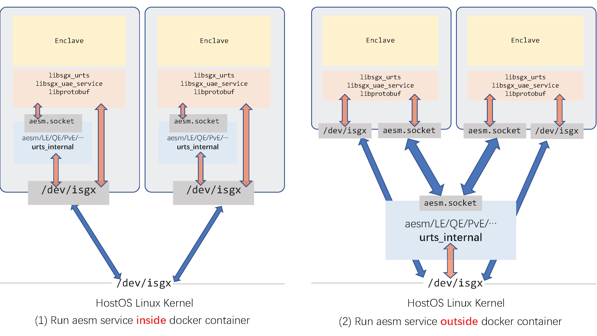

# Run Rust SGX Applications in Mesalock Linux

MesaLock Linux is a general purpose Linux distribution which aims to provide a safe and secure user space environment. To eliminate high-severe vulnerabilities caused by memory corruption, the whole user space applications are rewritten in memory-safe programming languages like Rust and Go. This extremely reduces attack surfaces of an operating system exposed in the wild, leaving the remaining attack surfaces auditable and restricted.  Therefore, MesaLock Linux can substantially improve the security of the Linux ecosystem. Additionally, thanks to the Linux kernel, MesaLock Linux supports a broad hardware environment, making it deployable in many places. Two main usage scenarios of MesaLock Linux are for containers and security-sensitive embedded devices. With the growth of the ecosystem, MesaLock Linux would also be adopted in the server environment in the future.

We believe that running Rust SGX applications inside Mesalock Linux could improve the security of SGX applications and reduce their attack surface significantly.

## Is it safe to run Rust SGX applications in Mesalock Linux?

A typical Rust SGX application has at least to components: one enclave, and one untrusted component. The enclave is self-contained and doesn't need dynamic loading. The untrusted component depends on `liburts` (untrusted runtime service library), which depends on the Application Enclave Services Manager library.

We show the dependency tree as follows. In this tree, we hide all the dynamic libraries which already exist in Mesalock Linux.

```bash
SGX Application
├── Enclave (statically linked)
└── Untrusted component
    └── SGX untrusted runtime (libsgx_urts.so)
        ├── libstdc++ (libstdc++.so.6)
        └── AESM service library (libsgx_uae_service.so)
            └── libprotobuf (libprotobuf.so.9)
                ├── libstdc++ (libstdc++.so.6)
                └── zlib (libz.so.1)    
```

We can see that, to support Rust SGX applications in Mesalock Linux, the minimum set of required shared library is : libsgx_urts.so, libsgx_uae_service.so, libstdc++.so.6, libz.so.1 and libprotobuf.so.9.

We refined the rules-of-thumb for hybrid memory-safe architecture designing and here is the refined version.

1. Unsafe components must not taint safe components, especially for public APIs and data structures.
2. Unsafe components should be as small as possible and decoupled from safe components.
3. Unsafe components should be explicitly marked during deployment and ready to upgrade.

Hence, we believe that running Rust SGX applications in Mesalock Linux could provide better security guarantees if they follow the memory safety principles.

## Solution Overview

The whole solution contains two steps:
1. Build Rust SGX applications in dev environment, such as Rust SGX docker container.
2. Run Rust SGX application in Mesalock Linux docker container.

Step 1 is trivial.

For step 2, the Intel AESM service is required. Technically, Intel AESM service listens at a domain socket `/var/run/aesmd/aesm.socket` and provide service via this domain socket. To interact with CPU, Intel AESM service needs to access `/dev/isgx`.

There are two options for running the aesm service: (1) start `aesmd` inside the Mesalock Linux container, or (2) start `aesmd` on the host OS and provide service to the SGX application inside the container. The first method provides better isolation for `aesmd`, but it would start a set of infrastructure enclaves for each docker container, wasting the limited EPC memory. The second one only launches one set of infrastructure enclaves for all SGX containers and we believe it is more efficient.

In our current solution, we put the AESM service process `aesmd` outside the Mesalock Linux docker container and only expose the domain socket `/var/run/aesm/aesm.socket` to the container. In this way, we isolate the AESM service along with the six foundation enclaves (Launch Enclave/Quoting Enclave/Provisioning Enclave/Provisioning Certification Enclave/Platform Service Enclave for long term pairing/Platform Service Enclave for session management) from Mesalock Linux docker container.



## Requirements

Rust SGX SDK and docker

## Step-by-step Guide

Step 1 : build SGX application in Rust SGX dev docker container.

```bash
$ git pull git@github.com:apache/teaclave-sgx-sdk.git
$ docker run -v /path/to/rust-sgx-sdk:/root/sgx -ti --device /dev/isgx baiduxlab/sgx-rust
```

In the Rust SGX dev docker container:

```bash
$ cd /root/sgx/samplecode/hello-rust
$ make
...(ignored many lines)...
</EnclaveConfiguration>
tcs_num 1, tcs_max_num 1, tcs_min_pool 1
The required memory is 1732608B.
Succeed.
SIGN =>  bin/enclave.signed.so
$ exit
```

Now the `hello-rust` sample has been compiled successfully.

Step 2 : run SGX application in Mesalock Linux docker container

```bash
$ docker run --rm -ti \
             --device /dev/isgx \                               # forward isgx device
             -v /path/to/rust-sgx-sdk:/root/sgx \               # add SDK
             -v /path/to/rust-sgx-sdk/mesalock-rt:/opt/sgxrt \  # add runtime lib
             -v /var/run/aesmd:/var/run/aesmd \                 # forward domain socket
             -e LD_LIBRARY_PATH=/opt/sgxrt \                    # set lib path
             -w /root/sgx/samplecode/hello-rust/bin \           # set working dir
             mesalocklinux/mesalock-linux
```
Now the Mesalock Linux docker container has been initiated using method (2) and an Ion shell has been launched. In the container, we execute:

```bash
:/root/sgx/samplecode/hello-rust/bin$ ./app
[+] Home dir is /root
[-] Open token file /root/enclave.token error! Will create one.
[+] Saved updated launch token!
[+] Init Enclave Successful 2!
This is a normal world string passed into Enclave!
This is a in-Enclave Rust string!
[+] say_something success...
```

## mesalock-rt Runtime Details

All these runtime shared libraries come from official releases, including Intel SGX SDK v2.0 release and Ubuntu 16.04 package archive.

| File | Size | SHA256 | Comes from |
| --- | --- | --- | --- |
| libprotobuf.so.9 | 1170328 | abd8b868f0f06584c30edbee90e27e2f8546ffe5bbe938922f62c5821b243925 | [libprotobuf9v5_2.6.1-1.3_amd64.deb](http://archive.ubuntu.com/ubuntu/pool/main/p/protobuf/libprotobuf9v5_2.6.1-1.3_amd64.deb) |
| libsgx_uae_service.so | 359944 | 67de93140307268871eb0e00ade9fc800bf3f45371b68ac79157c71b454edbaa | [sgx_linux_ubuntu16.04.1_x64_psw_2.0.100.40950.bin](https://download.01.org/intel-sgx/linux-2.0/sgx_linux_ubuntu16.04.1_x64_psw_2.0.100.40950.bin) |
| libsgx_urts.so | 166376 | 05a15c27432bded48b49b98f94649b4e90abaedbb4ce8f3c44baa1ff5ce2493d | [sgx_linux_ubuntu16.04.1_x64_psw_2.0.100.40950.bin](https://download.01.org/intel-sgx/linux-2.0/sgx_linux_ubuntu16.04.1_x64_psw_2.0.100.40950.bin) |
| libstdc++.so.6 | 1594800 | 5e68ec758e36fb2db90f6be673cf4112d144a2f29ba400cd5c6e0c8e56ad9408 | [libstdc++6_7.2.0-1ubuntu1~16.04_amd64.deb](https://launchpad.net/~ubuntu-toolchain-r/+archive/ubuntu/test/+files/libstdc++6_7.2.0-1ubuntu1~16.04_amd64.deb) |
| libz.so.1 | 104864 | a04cab74df9c7f96f82b34286bda5d4ee810feaac92dd2e8bcfe931d9c8baef4 | [zlib1g_1.2.11.dfsg-0ubuntu1_amd64.deb](http://us.archive.ubuntu.com/ubuntu/pool/main/z/zlib/zlib1g_1.2.11.dfsg-0ubuntu1_amd64.deb) |
